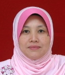
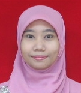
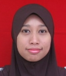
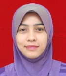
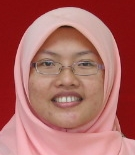
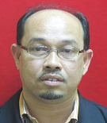
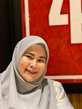

```{r setup, include=FALSE}
knitr::opts_chunk$set(echo = FALSE)

# Learn more about creating websites with Distill at:
# https://rstudio.github.io/distill/website.html
```

|{width="50%" height="50%" style="display: rounded-circle; margin: 0 auto"}|  
|:-----:|
| **Fazillah Bosli** |    
| Course Coordinator, Senior Lecturer |   
| Mgmt. Mathematics |  
| fazillah@uitm.edu.my |  
| <a href="https://expert.uitm.edu.my/profile.php?id=I7coKSJ7wWgTShTnEUhQevgsZVH+CTCOPaPYW7bOwBE=" target="_blank">View Profile</a> |  

:::::: {style="display: flex; "}

::: {.column width="30%"}
|{width="50%" height="50%" style="display: rounded-circle; margin: 0 auto"}|  
|:-----:|
| **Rosidah Ahmad (PhD)** |    
| Senior Lecturer |    
| Mathematics Education |  
| rosidah437@uitm.edu.my |  
| <a href="https://expert.uitm.edu.my/profile.php?id=gFgEUoquEqEhKH9HNLld6Tm68K4l0I6ce3MS+MtyoKs=" target="_blank">View Profile</a> |  
:::

::: {.column width="5%"}
\ 
<!-- an empty Div (with a whitespace), serving as
a column separator -->
:::

::: {.column width="30%"}
|{width="50%" height="50%" style="display: rounded-circle; margin: 0 auto"}|  
|:-----:|
| **Noor Rashidah Ali** |    
| Senior Lecturer |    
| Statistics |  
| norrash@uitm.edu.my |  
| <a href="https://expert.uitm.edu.my/profile.php?id=DwTLbI9WbPMnfLG2r7F5H5iQvFvX4qHynceoo9APinQ=" target="_blank">View Profile</a> |  
:::

::: {.column width="5%"}
\ 
<!-- an empty Div (with a whitespace), serving as
a column separator -->
:::

::: {.column width="30%"}  
|{width="50%" height="50%" style="display: rounded-circle; margin: 0 auto"}|
|:-----:|
| **Shaida Farhan Zakaria** |    
| Senior Lecturer |    
| Mathematics |  
| shahidafarhan@uitm.edu.my |  
| <a href="https://expert.uitm.edu.my/profile.php?id=BspHlBJTUkFLOWB60OQ3DVsr1yuXipbeaFDcQkrMTZc=" target="_blank">View Profile</a> |  
:::

::::::  

:::::: {style="display: flex; "}

::: {.column width="30%"}  
|{width="50%" height="50%" style="display: rounded-circle; margin: 0 auto"}|
|:-----:|
| **Asmahani Binti Nayan** |    
| Senior Lecturer |    
| Statistics |  
| asmahanin@uitm.edu.my |  
| <a href="https://expert.uitm.edu.my/profile.php?id=7TW/I4R0KTD45wDX3cXxkt5jVFJZEyuCrfMbgD9e7Y8=" target="_blank">View Profile</a> |  
:::

::: {.column width="5%"}
\ 
<!-- an empty Div (with a whitespace), serving as
a column separator -->
:::

::: {.column width="30%"}
||
|:-----:|
| **Norliana Najib (Dr.)** |    
| Senior Lecturer |    
| Mathematics |  
| liananajib@uitm.edu.my |  
| <a href="https://expert.uitm.edu.my/profile.php?id=AwM/Zz3RhgiCb4jxvklNIftyjyqul8fVNrLmqwxeS2s=" target="_blank">View Profile</a> |  
:::

::: {.column width="5%"}
\ 
<!-- an empty Div (with a whitespace), serving as
a column separator -->
:::

::: {.column width="30%"}
|{width="50%" height="50%" style="display: rounded-circle; margin: 0 auto"}|  
|:-----:|
| **Anis Mardiana Binti Ahmad** |        
| Senior Lecturer |   
| Mgmt. Mathematics |  
| anis513@kedah.uitm.edu.my |  
| <a href="https://expert.uitm.edu.my/profile.php?id=2pQJnZ9ZjhSpC+4junrXXGXZZ1SHLihagtP5TTEl5p8=" target="_blank">View Profile</a> |  
:::

::::::  

:::::: {style="display: flex; "}

::: {.column width="30%"}  
|{width="50%" height="50%" style="display: rounded-circle; margin: 0 auto"}|
|:-----:|
| **'Amirah Hazwani Abdul Rahim** |    
| Senior Lecturer |    
| Statistics |  
| amirah017@uitm.edu.my |  
| <a href="https://expert.uitm.edu.my/profile.php?id=I1bzg5Z/LbzURNc6V6s3V5Cw4rjGnv2MB2xEaGgiwHE=" target="_blank">View Profile</a> |  

:::

::: {.column width="5%"}
\ 
<!-- an empty Div (with a whitespace), serving as
a column separator -->
:::

::: {.column width="30%"}
|{width="50%" height="50%" style="display: rounded-circle; margin: 0 auto"}|  
|:-----:|
| **Ida Normaya Mohd Nasir (Dr.)** |    
| Senior Lecturer |    
| Statistics |  
| normaya@uitm.edu.my |  
| <a href="https://expert.uitm.edu.my/profile.php?id=RGAZeruxsBbbu4iKM5gF+D+xzXbrTXqKbCDt2EqmV2k=" target="_blank">View Profile</a> |  
:::

::: {.column width="5%"}
\ 
<!-- an empty Div (with a whitespace), serving as
a column separator -->
:::

::: {.column width="30%"}
|{width="50%" height="50%" style="display: rounded-circle; margin: 0 auto"}|  
|:-----:|
| **Kartini Kasim** |    
| Senior Lecturer |   
| Statistics |  
| kartini2929@uitm.edu.my |  
| <a href="https://expert.uitm.edu.my/profile.php?id=w6bR9Tbh5Y8xOTKZijPTnHXjaePG5+q6/VCdAeGXVg0=" target="_blank">View Profile</a> |  
:::

::::::  

:::::: {style="display: flex; "}

::: {.column width="30%"}  
|{width="50%" height="50%" style="display: rounded-circle; margin: 0 auto"}|
|:-----:|
| **Norashikin Nasarudin** |    
| Senior Lecturer |    
| Statistics |  
| norashikin116@uitm.edu.my |  
| <a href="https://expert.uitm.edu.my/profile.php?id=mxqFhTgzvi1vbH0Rw3iVep58ZXngVb4yFpi4WzcMT6U=" target="_blank">View Profile</a> |  
:::

::: {.column width="5%"}
\ 
<!-- an empty Div (with a whitespace), serving as
a column separator -->
:::

::: {.column width="30%"}
|{width="50%" height="50%" style="display: rounded-circle; margin: 0 auto"}|  
|:-----:|
| **Dr. Norin Rahayu Shamsuddin** |    
| Senior Lecturer |    
| Epidemiology & Statistics |  
| norinrahayu@uitm.edu.my |  
| <a href="https://expert.uitm.edu.my/profile.php?id=WEanYMmC98YU0mNPOF4Edzocj3thMWWLhbtoqM+5yrA=" target="_blank">View Profile</a> |  
:::

::: {.column width="5%"}
\ 
<!-- an empty Div (with a whitespace), serving as
a column separator -->
:::

::: {.column width="30%"}
|{width="50%" height="50%" style="display: rounded-circle; margin: 0 auto"}|  
|:-----:|
| **Nurazlina Abdul Rashid** |    
| Senior Lecturer |   
| Statistics |  
| azlina150@uitm.edu.my |  
| <a href="https://expert.uitm.edu.my/profile.php?id=CdGJDBudt6jVexAzyydxLNmmMH+HRcfxzH8xb9TLcXQ="l target="_blank">View Profile</a> |  
:::

::::::  

:::::: {style="display: flex; "}

::: {.column width="30%"}
||  
|:-----:|
| **Noor Hafizah Zainal Aznam** |  
| Senior Lecturer (Study Leave) |    
| Management Mathematics |
| noorhafizah@uitm.edu.my |  
| <a href="https://expert.uitm.edu.my/profile.php?id=r4jTSuRVylqP2yQqUZxg4J9KBmPnvEQtu4dEMJ7I/RQ=" target="_blank">View Profile</a> |  
:::

::: {.column width="5%"}
\ 
<!-- an empty Div (with a whitespace), serving as
a column separator -->
:::

::: {.column width="30%"}
|{width="50%" height="50%" style="display: rounded-circle; margin: 0 auto"}|  
|:-----:|
| **Siti Fairus Mokhtar** |    
| Senior Lecturer |   
| Statistics |  
| fairus706@uitm.edu.my |  
| <a href="https://expert.uitm.edu.my/profile.php?id=bBQC9G6pwZP07H8UxJnlZ0ku6VARheUg+OVOElB7HTw=" target="_blank">View Profile</a> |  
:::

::: {.column width="5%"}
\ 
<!-- an empty Div (with a whitespace), serving as
a column separator -->
:::

::: {.column width="30%"}  
||  
|:-----:|
| **Ab Razak Mansor** |    
| Senior Lecturer |    
| Physics |  
| arazman@uitm.edu.my |  
| <a href="https://expert.uitm.edu.my/profile.php?id=iafjCEhLtPrpYDvelAsJj4ypVRtC3zCRb2y7Rw/zFSQ=" target="_blank">View Profile</a> |  
:::

::::::  

:::::: {style="display: flex; "}

::: {.column width="30%"}
||
|:-----:|
| **Kamarul Ariffin Mansor** |    
| Senior Lecturer |    
| Mathematics |  
| ariff118@uitm.edu.my |  
| <a href="https://expert.uitm.edu.my/profile.php?id=jfJl92rZPRb9k0UzVrkKHc8BKRT+dbEhL8J6Qd6XU1o=" target="_blank">View Profile</a> |  
:::

::: {.column width="5%"}
\ 
<!-- an empty Div (with a whitespace), serving as
a column separator -->
:::

::: {.column width="30%"}
||  
|:-----:|
| **Afida Ahmad (Dr.)** |    
| Senior Lecturer |    
| Mathematics |  
| afidaahmad@uitm.edu.my |  
| <a href="https://expert.uitm.edu.my/profile.php?id=xs2tfNpxcB+fYe6imnMRQh2hwjBDGzCirKihlKiO3H8=" target="_blank">View Profile</a> |  
:::

::: {.column width="5%"}
\ 
<!-- an empty Div (with a whitespace), serving as
a column separator -->
:::

::: {.column width="30%"}  
||  
|:-----:|
| **Nora Baizura Mohd Isa** |    
| Lecturer |    
| Mathematics |  
| norabaizura@uitm.edu.my |  
| <a href="https://expert.uitm.edu.my/profile.php?id=HBRkvV2TGl/s7d7mVKPaMowvUnBmtMLGsdE3lyqpxrI=" target="_blank">View Profile</a> |  
:::

::::::  

:::::: {style="display: flex; "}

::: {.column width="30%"}
||
|:-----:|
| **Siti Nur Alwani Salleh (Dr.)** |    
| Senior Lecturer |    
| Mathematics |  
| sitinuralwani@uitm.edu.my |  
| <a href="https://expert.uitm.edu.my/profile.php?id=msbj6JA6mWA9tP6kZv3TVlUENdx+5ojO8FosdMS1bhs=" target="_blank">View Profile</a> |  
:::

::: {.column width="5%"}
\ 
<!-- an empty Div (with a whitespace), serving as
a column separator -->
:::

::: {.column width="30%"}
||  
|:-----:|
| **Syafiza Saila Samsudin** |    
| Senior Lecturer |    
| Mathematics |  
| syafi915@uitm.edu.my |  
| <a href="https://expert.uitm.edu.my/profile.php?id=l/Xl90KpCGddU2kFj3pJ3468+IkWWrMNZiaJ7ccMBA4=" target="_blank">View Profile</a> |  
:::

::: {.column width="5%"}
\ 
<!-- an empty Div (with a whitespace), serving as
a column separator -->
:::

::: {.column width="30%"}  
||  
|:-----:|
| **Norathirah Md Zin (Dr.)** |    
| Senior Lecturer |    
| Mathematics |  
| athirahmz@uitm.edu.my |  
| <a href="https://expert.uitm.edu.my/profile.php?id=uDdHAVPd3yikBitFtgage4iPBLQgPSSt/LZ8HFefZQ0=" target="_blank">View Profile</a> |  
:::

::::::  

Link to the [Official Staff Directory at UiTM Kedah](https://kedah.uitm.edu.my/directory/academic-staff)  
