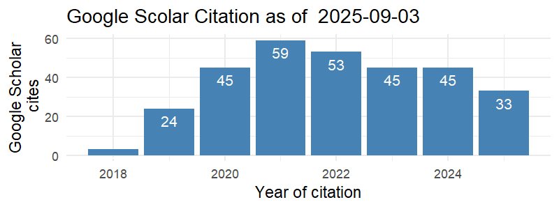

<!-- <link rel="stylesheet" href="styles.css" type="text/css"> -->

<!-- <body style="background-color:white;"> -->

<!-- <br></br> <br></br> -->

<!-- ## BIODATA PENSYARAH -->

<!-- <br></br> <br></br> -->

```{r include=FALSE}
library(scholar)

profile <- get_profile('5EiQMz0AAAAJ&hl')
total_cites <- profile$total_cites
h_index <- profile$h_index
i10_index <- profile$i10_index
```

::: {style="display: flex;"}
::: {.column width="35%"}
<center>

{width="250"}

</center>
:::

::: {.column width="10%"}
  <!-- an empty Div (with a whitespace), serving as
a column separator -->
:::

::: {.column width="55%"}
**SITI NUR ALWANI SALLEH (PhD)**\
*Universiti Teknologi MARA\
Kedah Branch Campus*

Siti Nur Alwani Salleh, is a senior lecturer at the Faculty of Computer Science and Mathematics, Universiti Teknologi MARA (UiTM), Kedah Branch Campus, Malaysia.

**Total Cites:** `r total_cites` , **h Index:** `r h_index` , **i10 Index:** `r i10_index`

<center>

[{width="350"}](https://scholar.google.com/citations?hl=en&user=qVPi6kYAAAAJ)

</center>
:::
:::

### A. Profil Pensyarah

1.  Nama: **SITI NUR ALWANI BINTI SALLEH**

2.  No. Pekerja:

3.  Bidang Penghususan: **MATEMATIK**

4.  Fakulti/Pusat/Kampus: **FSKM, UITM KEDAH**

5.  Jawatan: **PENSYARAH KANAN**

6.  Gred Jawatan/Pangkat: **DM52**

7.  Status Pekerjaan: **TETAP / BERPENCEN**

8.  Warganegara: **MALAYSIA**

### B. Kelayakan Akademik

|        Kelulusan (Bidang)         |    Nama IPT dan Negara    | Tarikh Dianugerahkan |
|:---------------------------------:|:-------------------------:|:--------------------:|
|          DOKTOR FALSAFAH          | UNIVERSITI PUTRA MALAYSIA |         2020         |
|           SARJANA SAINS           | UNIVERSITI PUTRA MALAYSIA |         2017         |
| BACELOR SAINS (K) MAJOR MATEMATIK | UNIVERSITI PUTRA MALAYSIA |         2015         |

### C. Kursus Pengajaran

#### Kursus yang Diajar

| Kod Kursus |             Nama Kursus             | Program |
|:----------:|:-----------------------------------:|:-------:|
|   MAT037   |       INTENSIVE MATHEMATICS 1       | BA-003  |
|   MAT112   |       BUSINESS MATHEMATICS 1        | BA-119  |
|   MAT210   |        DISCRETE MATHEMATICS         | CS-110  |
|   MAT183   |             CALCULUS I              | CS-110  |
|   CSC134   | COMPUTER AND INFORMATION PROCESSING | AM-110  |

#### Kursus yang boleh diajar

| Kod Kursus |       Nama Kursus       | Program |
|:----------:|:-----------------------:|:-------:|
|   MAT037   | INTENSIVE MATHEMATICS 1 |         |
|   MAT112   | BUSINESS MATHEMATICS 1  |         |
|   MAT210   |  DISCRETE MATHEMATICS   |         |
|   MAT183   |       CALCULUS I        |         |

### D. Pengalaman Kerja

|                 Jawatan                  |             Nama dan Alamat Majikan              | Tarikh Mula & Tamat |
|:----------------------------------------:|:------------------------------------------------:|:-------------------:|
|             TUTOR UNIVERSITI             |   JABATAN MATEMATIK, UNIVERSITI PUTRA MALAYSIA   |      2016-2020      |
| GURU TUISYEN (DARJAH 1-6, TINGKATAN 1-3) | PUSAT TUISYEN MATHS POWER, PRESINT 16, PUTRAJAYA |      2017-2019      |
|        HOME TUTOR (TINGKATAN 4-5)        | PUSAT TUISYEN MATHS POWER, PRESINT 16, PUTRAJAYA |      2017-2018      |

### E. Aktiviti Penyelidikan / Penulisan / Pengkaryaan / Pembentangan Kertas Kerja

#### 1. Pembentangan Kertas Kerja

1.  

#### 2. Penyelidikan

+----------------+-----------------------+--------+---------------------+
| Tajuk          | Amount Grant Diterima | Penaja | Tarikh Mula & Tamat |
+:==============:+:=====================:+:======:+:===================:+
|                |                       |        |                     |
+----------------+-----------------------+--------+---------------------+

#### 3. Penerbitan

##### i. Buku / Bab

| Judul Buku/Bab                                                                                                                                                                                                                                                                       | Peranan | Penerbit  | Negara/Negeri Penerbit | Tarikh Diterbit |
|--------------------------------------------------------------------------------------------------------------------------------------------------------------------------------------------------------------------------------------------------------------------------------------|:-------:|:---------:|:----------------------:|:---------------:|
| Siti Nur Alwani Salleh, Norfifah Bachok, Norihan Md Arifin and Fadzilah Md Ali. Magnetic Field Effect on Nanofluid Flow and Heat Transfer past a Moving Horizontal Thin Needle with Stability Analysis. In Embracing Mathematical Diversity, 182-193 (2019). ISBN 978-967-2395-08-9. | Penulis | UPM Press |   Selangor Malaysia    |      2019       |

##### ii. Artikel/Rencana

+------------------------------------------------------------------------------------------------------------------------------------------------------------------------------------------------------------------------------------------------------------------------------------+-------------------------------------------------------------+---------+---------------+-----------------+
| Tajuk Artikel/Rencana                                                                                                                                                                                                                                                              | Nama Jurnal/Majalah                                         | Jid/Bil | Penerbit      | Tarikh Diterbit |
+====================================================================================================================================================================================================================================================================================+:===========================================================:+:=======:+:=============:+:===============:+
| Siti Nur Alwani Salleh, Norfifah Bachok, Norihan Md Arifin, Fadzilah Md Ali and Ioan Pop. Stability Analysis of Mixed Convection Flow towards a Moving Thin Needle in Nanofluid. In Applied Sciences, 8:842 (2018), Q3.                                                            | Applied Sciences                                            | 8       | MDPI          | 2018            |
+------------------------------------------------------------------------------------------------------------------------------------------------------------------------------------------------------------------------------------------------------------------------------------+-------------------------------------------------------------+---------+---------------+-----------------+
| Siti Nur Alwani Salleh, Norfifah Bachok, Norihan Md Arifin, Fadzilah Md Ali and Ioan Pop. Magnetohydrodynamics Flow past a Moving Vertical Thin Needle in a Nanofluid with Stability Analysis. In Energies, 11:3297 (2018), Q2.                                                    | Energies                                                    | 11      | MDPI          | 2018            |
+------------------------------------------------------------------------------------------------------------------------------------------------------------------------------------------------------------------------------------------------------------------------------------+-------------------------------------------------------------+---------+---------------+-----------------+
| Siti Nur Alwani Salleh, Norfifah Bachok, Norihan Md Arifin and Fadzilah Md Ali. Numerical Analysis of Boundary Layer Flow adjacent to a Thin Needle in Nanofluid with the Presence of Heat Source and Chemical Reaction. In Symmetry, 11:543 (2019), Q2.                           | Symmetry                                                    | 11      | MDPI          | 2019            |
+------------------------------------------------------------------------------------------------------------------------------------------------------------------------------------------------------------------------------------------------------------------------------------+-------------------------------------------------------------+---------+---------------+-----------------+
| Siti Nur Alwani Salleh, Norfifah Bachok, Norihan Md Arifin and Fadzilah Md Ali. Slip Effect on Mixed Convection Flow Past a Thin Needle in Nanofluid Using Buongiorno's Model. In Journal of Advanced Research in Fluid Mechanics and Thermal Sciences, 59:243-253 (2019), Scopus. | Journal of Advanced Research in Fluid Mechanics and Thermal | 59      | Akademia Baru | 2019            |
|                                                                                                                                                                                                                                                                                    | Sciences                                                    |         |               |                 |
+------------------------------------------------------------------------------------------------------------------------------------------------------------------------------------------------------------------------------------------------------------------------------------+-------------------------------------------------------------+---------+---------------+-----------------+
| Siti Nur Alwani Salleh, Norfifah Bachok, Fadzilah Md Ali and Norihan Md Arifin. Analysis of Heat and Mass Transfer for Second Order Slip Flow on a Thin Needle using a Two phase Nanofluid Model. In Symmetry, 12:1176 (2020), Q2.                                                 | Symmetry                                                    | 12      | MDPI          | 2020            |
+------------------------------------------------------------------------------------------------------------------------------------------------------------------------------------------------------------------------------------------------------------------------------------+-------------------------------------------------------------+---------+---------------+-----------------+
| Siti Nur Alwani Salleh, Norfifah Bachok, Fadzilah Md Ali and Norihan Md Arifin. Influence of Soret and Dufour on Forced Convection Flow towards a Moving Thin Needle considering Buongiorno's Nanofluid Model. In Alexandria Engineering Journal, 59:3897- 3906 (2020), Q1.        | Alexandria Engineering Journal                              | 59      | Elsevier      | 2020            |
+------------------------------------------------------------------------------------------------------------------------------------------------------------------------------------------------------------------------------------------------------------------------------------+-------------------------------------------------------------+---------+---------------+-----------------+
|                                                                                                                                                                                                                                                                                    |                                                             |         |               |                 |
+------------------------------------------------------------------------------------------------------------------------------------------------------------------------------------------------------------------------------------------------------------------------------------+-------------------------------------------------------------+---------+---------------+-----------------+

##### iii. Pembentangan Kertas Kerja

+-----------------------------------------------------------------------------------------------------------------------------------------------------------------------------------------------------------------+----------------------------------------------------------------------------------------+-------------------------+-----------------+
| Tajuk Kertas Kerja                                                                                                                                                                                              | Nama Konferensi                                                                        | Tempat/Negara           | Tarikh Diterbit |
+=================================================================================================================================================================================================================+:======================================================================================:+:=======================:+:===============:+
| Stability Analysis of a Rotating Flow toward a Shrinking Permeable Surface in Nanofluid. Published in Malaysian Journal of Science, Scopus.                                                                     | 3rd International Conference on Mathematical Sciences and Statistics (ICMSS2018)       | Le Meridien, Putrajaya  | 2018            |
+-----------------------------------------------------------------------------------------------------------------------------------------------------------------------------------------------------------------+----------------------------------------------------------------------------------------+-------------------------+-----------------+
| Stability Analysis of Solutions on Boundary Layer Flow Past a Moving Thin Needle in a Nanofluid with Slip Effect. Published in ASM Science Journal, Scopus.                                                     | International Quantitative Research and Applications Conference 2018 (IQRAC2018)       | Kuching, Sarawak        | 2018            |
+-----------------------------------------------------------------------------------------------------------------------------------------------------------------------------------------------------------------+----------------------------------------------------------------------------------------+-------------------------+-----------------+
| Effect of Buoyancy Force on the Flow and Heat Transfer around a Thin Needle in Al2O3-Cu Hybrid Nanofluid. Published in CFD Letters, Scopus.                                                                     | 3rd International Symposium on Fluid Mechanics and Thermal Sciences (3rd IS-FMTS 2019) | The Everly Putrajaya    | 2019            |
+-----------------------------------------------------------------------------------------------------------------------------------------------------------------------------------------------------------------+----------------------------------------------------------------------------------------+-------------------------+-----------------+
| Magnetic Field Effect on Nanofluid Flow and Heat Transfer past a Moving Horizontal Thin Needle with Stability Analysis. Published in Embracing Mathematical Diversity, Book Chapter, UPM Press.                 | Seminar on Mathematical Sciences (SOMS 2019)                                           | Pusat Asasi UPM         | 2019            |
+-----------------------------------------------------------------------------------------------------------------------------------------------------------------------------------------------------------------+----------------------------------------------------------------------------------------+-------------------------+-----------------+
| Stability Analysis of Nanofluid Flow past a Moving Thin Needle subject to Convective Surface Boundary Conditions. Published in AIP Conference Proceedings, Scopus.                                              | International Conference on Mathematical Sciences and Technology 2018 (MathTech 2018)  | Hotel Equatorial Penang | 2019            |
+-----------------------------------------------------------------------------------------------------------------------------------------------------------------------------------------------------------------+----------------------------------------------------------------------------------------+-------------------------+-----------------+
| Numerical Study on Flow of a Hybrid Nanofluid due to a Vertical Thin Needle with Slip Effect. Published in AIP Conference Proceedings, Scopus.                                                                  | Recent Advances in Mathematical Sciences and its Applications (RAMSA-2020)             | Noida, India            | 2020            |
+-----------------------------------------------------------------------------------------------------------------------------------------------------------------------------------------------------------------+----------------------------------------------------------------------------------------+-------------------------+-----------------+
| Flow and Wall Heat Transfer due to a Continuously Moving Slender Needle in Hybrid Nanofluid with Stability Analysis. Published in Journal of Advanced Research in Fluid Mechanics and Thermal Sciences, Scopus. | International Conference on Recent Advances in Applied Mathematics 2020 (ICRAAM2020)   | Kuala Lumpur            | 2020            |
+-----------------------------------------------------------------------------------------------------------------------------------------------------------------------------------------------------------------+----------------------------------------------------------------------------------------+-------------------------+-----------------+

### F. Aktiviti Pentadbiran (dalam tempoh 3 tahun terakhir)

#### 1. Jawatan Pentadbiran / Akademik

| Nama Jawatan | Tarikh Dari | Tarikh Hingga |
|--------------|-------------|---------------|
|              |             |               |

#### 2. Jawatankuasa Di Dalam/Di Luar UiTM

+-------------------+-----------------+----------------+-----------------+
| Nama Jawatankuasa | Jawatan         | Tarikh Dari    | Tarikh Hingga   |
+:=================:+:===============:+:==============:+:===============:+
| Bengkel SPSS      | Pengerusi       | 01/02/2021     | 30/04/2021      |
+-------------------+-----------------+----------------+-----------------+
| iCMS 2021         | AJK             | 01/01/2021     | 31/12/2021      |
+-------------------+-----------------+----------------+-----------------+
| JQA               | AJK             | 01/01/2021     | 31/12/2021      |
+-------------------+-----------------+----------------+-----------------+
| Unit POSTGRAD     | AJK             | 01/01/2021     | 31/12/2021      |
+-------------------+-----------------+----------------+-----------------+
| Lic MAT112        | LIC             | 03/2021        | 08/2021         |
+-------------------+-----------------+----------------+-----------------+
| FSKM4.0U          | AJK             | 01/03/2021     | 31/12/2021      |
+-------------------+-----------------+----------------+-----------------+

#### 3. Sumbangan Profesional/Masyarakat

| Nama Badan Profesional/Kebajikan | Jawatan | Tarikh Dari | Tarikh Hingga |
|:--------------------------------:|:-------:|:-----------:|:-------------:|
|                                  |         |             |               |

#### 4. Keahlian Dalam Badan Profesional

+----------------------------------------------+----------+----------------+------------+-------------+---------------+
| Nama Badan Profesional/Kebajikan             | No. Ahli | Jenis Keahlian | Peranan    | Tarikh Dari | Tarikh Hingga |
+:============================================:+:========:+:==============:+:==========:+:===========:+:=============:+
| Persatuan Sains Matematik Malaysia (PERSAMA) | SS2021-5 | Seumur Hidup   | Ahli Biasa | 3/26/2021   | \-            |
+----------------------------------------------+----------+----------------+------------+-------------+---------------+

```{r include=FALSE}
library(scholar)
library(ggplot2)

cit <- get_citation_history('5EiQMz0AAAAJ&hl')
png('scholar_citations_5EiQMz0AAAAJ&hl.png', width=800, height=300, res=150)
ggplot(cit,aes(x=year,y=cites)) + geom_bar(stat='identity', fill="steelblue") + 
  theme_minimal() + 
  xlab('Year of citation') + 
  ylab('Google Scholar\n cites') + 
  geom_text(aes(label=cites), vjust=1.6, color="white", size=3.5) +
  ggtitle(paste('Google Scolar Citation as of ', Sys.Date(), sep = " ")) 
#  annotate('text',label=format(Sys.time(), "%Y-%m-%d %H:%M:%S %Z"), 
#           x=-Inf, y=Inf, vjust=1.5, hjust=-0.05, size=3, colour='blue')
dev.off()
```
