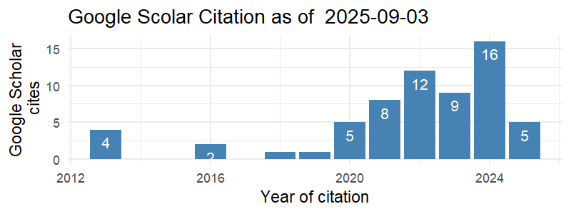

<!-- <link rel="stylesheet" href="styles.css" type="text/css"> -->

<!-- <body style="background-color:white;"> -->

<!-- <br></br> <br></br> -->

<!-- ## BIODATA PENSYARAH -->

<!-- <br></br> <br></br> -->

```{r include=FALSE}
library(scholar)

profile <- get_profile('jTX_qu0AAAAJ&hl')
total_cites <- profile$total_cites
h_index <- profile$h_index
i10_index <- profile$i10_index
```

::: {style="display: flex;"}
::: {.column width="35%"}
<center>

{width="250"}

</center>
:::

::: {.column width="10%"}
  <!-- an empty Div (with a whitespace), serving as
a column separator -->
:::

::: {.column width="55%"}
**NURAZLINA BT ABDUL RASHID**\
*Universiti Teknologi MARA\
Kedah Branch Campus*

NURAZLINA BT ABDUL RASHID, is a senior lecturer at the Faculty of Computer Science and Mathematics, Universiti Teknologi MARA (UiTM), Kedah Branch Campus, Malaysia.

**Total Cites:** `r total_cites` , **h Index:** `r h_index` , **i10 Index:** `r i10_index`

<center>

[{width="350" height="131"}](https://scholar.google.com/citations?hl=en&user=qVPi6kYAAAAJ)

</center>
:::
:::

### A. Profil Pensyarah

1.  Nama: **NURAZLINA BT ABDUL RASHID**

2.  No. Pekerja: **277150**

3.  Bidang Penghususan: **STATISTIK GUNAAN**

4.  Fakulti/Pusat/Kampus: **FSKM, UITM KEDAH**

5.  Jawatan: **PENSYARAH KANAN**

6.  Gred Jawatan/Pangkat: **DM52**

7.  Status Pekerjaan: **TETAP / BERPENCEN**

8.  Warganegara: **MALAYSIA**

### B. Kelayakan Akademik

|          Kelulusan (Bidang)          | Nama IPT dan Negara | Tarikh Dianugerahkan |
|:------------------------------------:|:-------------------:|:--------------------:|
|   IJAZAH SARJANA STATISTIK GUNAAN    |        UiTM         |         2010         |
| IJAZAH SARJANA MUDA STATISTIK GUNAAN |        UiTM         |         2008         |

### C. Kursus Pengajaran

#### Kursus yang Diajar

|  Kod Kursus   |              Nama Kursus               |   Program   |
|:-------------:|:--------------------------------------:|:-----------:|
| QMT181/STA104 |  INTRODUCTION TO BUSINESS STATISTICS   | BA119/BA111 |
|    STA116     | INTRODUCTION TO PROBABILITY STATISTICS |    CS110    |
|               |                                        |             |

#### Kursus yang boleh diajar

| Kod Kursus |                Nama Kursus                 | Program |
|:----------:|:------------------------------------------:|:-------:|
|   STA404   | STATISTICS FOR BUSINESS AND SOCIAL SCIENCE |         |

### D. Pengalaman Kerja

|     Jawatan     | Nama dan Alamat Majikan | Tarikh Mula & Tamat |
|:---------------:|:-----------------------:|:-------------------:|
| PENSYARAH KANAN |       UiTM KEDAH        |     2010 - KINI     |
|                 |                         |                     |

### E. Aktiviti Penyelidikan / Penulisan / Pengkaryaan / Pembentangan Kertas Kerja

#### 1. Pembentangan Kertas Kerja

1.  PENYELIDIK KAJIAN SOSIAL EKONOMI PENDUDUK LUAR BANDAR NEGERI KEDAH (PASCA COVID

2.  PENULIS NOVEL GRAFIK EDISI KHAS COVID-19: KERANA TERPAKSA

3.  PENULIS NOVEL GRAFIK EDISI KHAS COVID-19: LAKSA BAKAT TERPENDAM

4.  PERUNDING BAGI PROJEK: KAJIAN PROFIL SOSAL EKONOMI DEWAN UNDANGAN NEGERI SUKA MENANTI, ALOR SETAR

5.  LAPORAN KAJIAN PROFIL SOSIAL EKONOMI DUN SUKA MENANTI ALOR SETAR

6.  COMPARISON ANALYSIS: LARGE DATA CLASSIFICATION USING PLS-DA AND DECISION TREE

7.  PERFORMANCE OF CLASSIFICATION ANALYSIS: A COMPARATIVE STUDY BETWEEN PLS-DA AND INTEGRATING PCA+LDA

8.  THE EFFECTIVENESS OF USING AskMe!STA404: ARE STUDENTS READY?

9.  PEMBANGUN BAHAN KURSUS MASSIVE OPEN LEARNING ONLINE COURSE (MOOC) STA210

10. PENULIS LAPORAN TEKNIKAL SELF-REVIEW REPORT (SRR) BAGI FAKULTI SAINS KOMPUTER DAN MATEMATIK 2020

11. PENULIS LAPORAN TEKNIKAL SELF-REVIEW REPORT (SRR) BAGI FAKULTI SAINS KOMPUTER DAN MATEMATIK 2019

12. THE EFFECT OF DIFFERENT SAMPLING METHODS ON IMBALANCED DATASETS IN BANKRUPTCY

#### 2. Penyelidikan

+-------------------------------------------------------------------------------------------------------+-----------------------+------------------+---------------------+
| Tajuk                                                                                                 | Amount Grant Diterima | Penaja           | Tarikh Mula & Tamat |
+:=====================================================================================================:+:=====================:+:================:+:===================:+
| GERAN PENYELIDIKAN ZAKAT NEGERI KEDAH                                                                 | 5,000                 | ZAWAS            | 2021                |
+-------------------------------------------------------------------------------------------------------+-----------------------+------------------+---------------------+
| GERAN PENYELIDIKAN SOSIAL EKONOMI DUN DUKA MENANTI ALOR SETAR NEGERI KEDAH                            | 6,000                 | DUN SUKA MENANTI | 2019-2020           |
+-------------------------------------------------------------------------------------------------------+-----------------------+------------------+---------------------+
| GERAN DANA KECEMERLANGAN UiTM KEDAH: PERFORMANCE OF BANKRUPTCY PREDICTION MODEL OF IMBALANCED DATASET | 1,000                 | UITM KEDAH       | 2018                |
+-------------------------------------------------------------------------------------------------------+-----------------------+------------------+---------------------+

#### 3. Penerbitan

##### i. Buku / Bab

| Judul Buku/Bab | Peranan | Penerbit | Negara/Negeri Penerbit | Tarikh Diterbit |
|----------------|:-------:|:--------:|:----------------------:|:---------------:|
|                |         |          |                        |                 |

##### ii. Artikel/Rencana

+----------------------------------------------------------------------------------------------------+------------------------------------+---------+----------+-----------------+
| Tajuk Artikel/Rencana                                                                              | Nama Jurnal/Majalah                | Jid/Bil | Penerbit | Tarikh Diterbit |
+====================================================================================================+====================================+:=======:+:========:+:===============:+
| COMPARISON ANALYSIS: LARGE DATA CLASSIFICATION USING PLS-DA AND DECISION TREE                      | MATHEMATICS AND STATISTICS         |         | HRPUB    | 2020            |
+----------------------------------------------------------------------------------------------------+------------------------------------+---------+----------+-----------------+
| PERFORMANCE OF CLASSIFICATION ANALYSIS: A COMPARATIVE STUDY BETWEEN PLS-DA AND INTEGRATING PCA+LDA | JOURNAL MATHEMATICS AND STATISTICS |         | HRPUB    | 2019            |
+----------------------------------------------------------------------------------------------------+------------------------------------+---------+----------+-----------------+
|                                                                                                    |                                    |         |          |                 |
+----------------------------------------------------------------------------------------------------+------------------------------------+---------+----------+-----------------+
|                                                                                                    |                                    |         |          |                 |
+----------------------------------------------------------------------------------------------------+------------------------------------+---------+----------+-----------------+
|                                                                                                    |                                    |         |          |                 |
+----------------------------------------------------------------------------------------------------+------------------------------------+---------+----------+-----------------+
|                                                                                                    |                                    |         |          |                 |
+----------------------------------------------------------------------------------------------------+------------------------------------+---------+----------+-----------------+
|                                                                                                    |                                    |         |          |                 |
+----------------------------------------------------------------------------------------------------+------------------------------------+---------+----------+-----------------+

##### iii. Pembentangan Kertas Kerja

+----------------------------------------------------------------------------------------------------+-----------------+---------------+-----------------+
| Tajuk Kertas Kerja                                                                                 | Nama Konferensi | Tempat/Negara | Tarikh Diterbit |
+====================================================================================================+:===============:+:=============:+:===============:+
| PERFORMANCE OF CLASSIFICATION ANALYSIS: A COMPARATIVE STUDY BETWEEN PLS-DA AND INTEGRATING PCA+LDA | ICMS2019        | UiTM KEDAH    | 2019            |
+----------------------------------------------------------------------------------------------------+-----------------+---------------+-----------------+

### F. Aktiviti Pentadbiran (dalam tempoh 3 tahun terakhir)

#### 1. Jawatan Pentadbiran / Akademik

| Nama Jawatan                       | Tarikh Dari | Tarikh Hingga |
|------------------------------------|:-----------:|:-------------:|
| RESOURCE PERSON (RP QMT181/STA104) |    2018     |     2020      |

#### 2. Jawatankuasa Di Dalam/Di Luar UiTM

|                Nama Jawatankuasa                 |   Jawatan   | Tarikh Dari | Tarikh Hingga |
|:------------------------------------------------:|:-----------:|:-----------:|:-------------:|
|                    ICMS 2019                     | AJK PROMOSI |  10-Jul-18  |   31-Dec-19   |
|                    ICMS 2021                     | AJK PROMOSI |  12-Jul-20  |   31-Dec-21   |
|               AJK ICRESS 2018-2020               | AJK FAKULTI |             |               |
|           SETIAUSAHA FAKULTI 2018-2020           | SETIAUSAHA  |             |               |
| PENGERUSI BENGKEL PENULISAN PENERBITAN BUKU 2021 |  PENGERUSI  |             |               |
|                                                  |             |             |               |

#### 3. Sumbangan Profesional/Masyarakat

| Nama Badan Profesional/Kebajikan |  Jawatan   | Tarikh Dari | Tarikh Hingga |
|:--------------------------------:|:----------:|:-----------:|:-------------:|
|   MALAYSIA RELIEF AGENCY(MRA)    | PENYELIDIK |    2021     |     2021      |

#### 4. Keahlian Dalam Badan Profesional

+----------------------------------+----------+----------------+---------+-------------+---------------+
| Nama Badan Profesional/Kebajikan | No. Ahli | Jenis Keahlian | Peranan | Tarikh Dari | Tarikh Hingga |
+:================================:+:========:+:==============:+:=======:+:===========:+:=============:+
|                                  |          |                |         |             |               |
+----------------------------------+----------+----------------+---------+-------------+---------------+

```{r include=FALSE}
library(scholar)
library(ggplot2)

cit <- get_citation_history('jTX_qu0AAAAJ&hl')
png('scholar_citations_jTX_qu0AAAAJ&hl.png', width=800, height=300, res=150)
ggplot(cit,aes(x=year,y=cites)) + geom_bar(stat='identity', fill="steelblue") + 
  theme_minimal() + 
  xlab('Year of citation') + 
  ylab('Google Scholar\n cites') + 
  geom_text(aes(label=cites), vjust=1.6, color="white", size=3.5) +
  ggtitle(paste('Google Scolar Citation as of ', Sys.Date(), sep = " ")) 
#  annotate('text',label=format(Sys.time(), "%Y-%m-%d %H:%M:%S %Z"), 
#           x=-Inf, y=Inf, vjust=1.5, hjust=-0.05, size=3, colour='blue')
dev.off()
```
