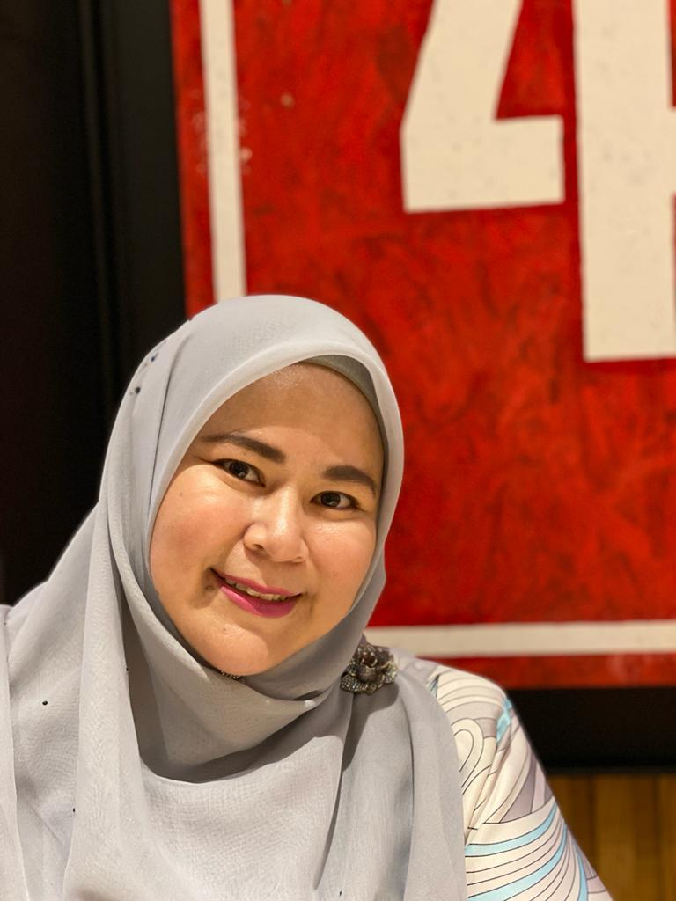
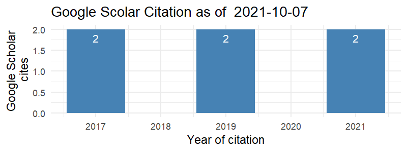

<!-- <link rel="stylesheet" href="styles.css" type="text/css"> -->

<!-- <body style="background-color:white;"> -->

<!-- <br></br> <br></br> -->

<!-- ## BIODATA PENSYARAH -->

<!-- <br></br> <br></br> -->

```{r include=FALSE}
library(scholar)

profile <- get_profile('qVPi6kYAAAAJ')
total_cites <- profile$total_cites
h_index <- profile$h_index
i10_index <- profile$i10_index
```

::: {style="display: flex;"}
::: {.column width="35%"}
<center>

{width="250"}

</center>
:::

::: {.column width="10%"}
  <!-- an empty Div (with a whitespace), serving as
a column separator -->
:::

::: {.column width="55%"}
**SYAFIZA SAILA SAMSUDIN**\
*Universiti Teknologi MARA\
Kedah Branch Campus*

Syafiza Saila Samsudin, is a senior lecturer at the Faculty of Computer Science and Mathematics, Universiti Teknologi MARA (UiTM), Kedah Branch Campus, Malaysia.

**Total Cites:** `r total_cites` , **h Index:** `r h_index` , **i10 Index:** `r i10_index`

<center>

[{width="350"}](https://scholar.google.com/citations?hl=en&user=qVPi6kYAAAAJ)

</center>
:::
:::

### A. Profil Pensyarah

1.  Nama: **SYAFIZA SAILA SAMSUDIN**

2.  No. Pekerja: **263915**

3.  Bidang Penghususan: **MATEMATIK**

4.  Fakulti/Pusat/Kampus: **FSKM, UITM KEDAH**

5.  Jawatan: **PENSYARAH KANAN**

6.  Gred Jawatan/Pangkat: **DM52**

7.  Status Pekerjaan: **TETAP / BERPENCEN**

8.  Warganegara: **MALAYSIA**

### B. Kelayakan Akademik

|     Kelulusan (Bidang)     |    Nama IPT dan Negara    | Tarikh Dianugerahkan |
|:--------------------------:|:-------------------------:|:--------------------:|
|      MSc. Mathematics      | UNIVERSITI SAINS MALAYSIA |         2009         |
| BSc. In Mathematics (Hons) | UNIVERSITI TEKNOLOGI MARA |         2006         |

### C. Kursus Pengajaran

#### Kursus yang Diajar

| Kod Kursus |     Nama Kursus      |   Program    |
|:----------:|:--------------------:|:------------:|
|   MAT112   | BUSINESS MATHEMATICS | BA111, BA119 |
|   MAT183   |      CALCULUS 1      |    CS110     |
|   MAT402   | BUSINESS MATHEMATICS | AM228, AC220 |

#### Kursus yang boleh diajar

| Kod Kursus | Nama Kursus | Program |
|:----------:|:-----------:|:-------:|
|            |             |         |

### D. Pengalaman Kerja

|     Jawatan     | Nama dan Alamat Majikan | Tarikh Mula & Tamat |
|:---------------:|:-----------------------:|:-------------------:|
|    PENSYARAH    |       UiTM SABAH        |     2009 - 2012     |
| PENSYARAH KANAN |       UiTM PAHANG       |     2012 - 2020     |

### E. Aktiviti Penyelidikan / Penulisan / Pengkaryaan / Pembentangan Kertas Kerja

#### 1. Pembentangan Kertas Kerja

1.  

#### 2. Penyelidikan

+------------------+-----------------------+--------+---------------------+
| Tajuk            | Amount Grant Diterima | Penaja | Tarikh Mula & Tamat |
+:================:+:=====================:+:======:+:===================:+
|                  |                       |        |                     |
+------------------+-----------------------+--------+---------------------+

#### 3. Penerbitan

##### i. Buku / Bab

| Judul Buku/Bab | Peranan | Penerbit | Negara/Negeri Penerbit | Tarikh Diterbit |
|----------------|:-------:|:--------:|:----------------------:|:---------------:|
|                |         |          |                        |                 |

##### ii. Artikel/Rencana

+-----------------------------------------------------------------------------------------------------------------------------------+-------------------------------------------------------------------------------+---------+----------+-----------------+
| Tajuk Artikel/Rencana                                                                                                             | Nama Jurnal/Majalah                                                           | Jid/Bil | Penerbit | Tarikh Diterbit |
+===================================================================================================================================+===============================================================================+:=======:+:========:+:===============:+
| LEARNING STATISTICS COURSE USING COMPUTER_AIDED SOFTWARE: A CASE STUDY AMONG FURNITURE TECHNOLOGY STUDENTS                        | International Journal of Modern Trends in Social Sciences (IJMTSS)            | 3       |          | 2020            |
+-----------------------------------------------------------------------------------------------------------------------------------+-------------------------------------------------------------------------------+---------+----------+-----------------+
| Mathematical nature's pattern in Zinnia Peruviana                                                                                 | AIP Conference Proceedings                                                    |         |          | 2018            |
+-----------------------------------------------------------------------------------------------------------------------------------+-------------------------------------------------------------------------------+---------+----------+-----------------+
| An analysis of mathematical errors in business mathematics                                                                        | AIP Conference Proceedings                                                    |         |          | 2018            |
+-----------------------------------------------------------------------------------------------------------------------------------+-------------------------------------------------------------------------------+---------+----------+-----------------+
| Academic Poster Evaluation by Mamdani-Type Fuzzy Inference System                                                                 | Regional Conference on Science, Technology and Social Sciences (RCSTSS 2016)  | 1       | SPRINGER | 2018            |
+-----------------------------------------------------------------------------------------------------------------------------------+-------------------------------------------------------------------------------+---------+----------+-----------------+
| EVALUATION OF LIBRARY SERVICES USING FUZZY APPROACH                                                                               | Business Management and Computing Research Colloqium (BMCRC)                  |         |          | 2016            |
+-----------------------------------------------------------------------------------------------------------------------------------+-------------------------------------------------------------------------------+---------+----------+-----------------+
| Blanded Learning: Readiness Study Among Mathematics and Statistics Lecturer in UiTM Cawangan Pahang                               | Business Management and Computing Research Colloqium (BMCRC)                  |         |          | 2016            |
+-----------------------------------------------------------------------------------------------------------------------------------+-------------------------------------------------------------------------------+---------+----------+-----------------+
| Effectiveness of Constructive Approach on Students' Achievement in Mathematics: A Case Study at Primary School in Kuantan, Pahang | AIP Conference Proceedings                                                    |         |          | 2016            |
+-----------------------------------------------------------------------------------------------------------------------------------+-------------------------------------------------------------------------------+---------+----------+-----------------+

##### iii. Pembentangan Kertas Kerja

+----------------------------------------------------------------------------------------------------+-------------------------------------------------------------------------------+---------------+-----------------+
| Tajuk Kertas Kerja                                                                                 | Nama Konferensi                                                               | Tempat/Negara | Tarikh Diterbit |
+====================================================================================================+:=============================================================================:+:=============:+:===============:+
| Leaf Spot Disease Severity Among Common Vegetables using Fuzzy Analytical Hierarchy Process (FAHP) | Regional Conference on Science, Technology and Social Sciences (RCSTSS 2018)  | MALAYSIA      | 2021            |
+----------------------------------------------------------------------------------------------------+-------------------------------------------------------------------------------+---------------+-----------------+

### F. Aktiviti Pentadbiran (dalam tempoh 3 tahun terakhir)

#### 1. Jawatan Pentadbiran / Akademik

| Nama Jawatan | Tarikh Dari | Tarikh Hingga |
|--------------|-------------|---------------|
|              |             |               |

#### 2. Jawatankuasa Di Dalam/Di Luar UiTM

|              Nama Jawatankuasa               |    Jawatan    | Tarikh Dari | Tarikh Hingga |
|:--------------------------------------------:|:-------------:|:-----------:|:-------------:|
|                  Felo AKNC                   |  Penyelaras   |  1-Jan-21   |   31-Dec-21   |
|                   Auditor                    | Ketua Auditor |  1-Jan-21   |   31-Dec-21   |
|               Setiausaha FSKM                |  Setiausaha   |  1-Jan-21   |   31-Dec-21   |
|                 AJK iCMS2021                 |      AJK      |  1-Jan-21   |   31-Dec-21   |
| AJK Laporan Teknikal Self-Review Report FSKM |      AJK      |  1-Jan-21   |   31-Dec-21   |
|         Setiausaha Bengkel Big Data          |  Setiausaha   |  4/22/2021  |   4/23/2021   |

#### 3. Sumbangan Profesional/Masyarakat

| Nama Badan Profesional/Kebajikan | Jawatan | Tarikh Dari | Tarikh Hingga |
|:--------------------------------:|:-------:|:-----------:|:-------------:|
|                                  |         |             |               |

#### 4. Keahlian Dalam Badan Profesional

+----------------------------------+----------+-------------------+------------+-------------+---------------+
| Nama Badan Profesional/Kebajikan | No. Ahli | Jenis Keahlian    | Peranan    | Tarikh Dari | Tarikh Hingga |
+:================================:+:========:+:=================:+:==========:+:===========:+:=============:+
| PERSATUAN MATEMATIK MALAYSIA     | SS2020-6 | AHLI SEUMUR HIDUP | AHLI BIASA |             |               |
+----------------------------------+----------+-------------------+------------+-------------+---------------+

```{r include=FALSE}
library(scholar)
library(ggplot2)

cit <- get_citation_history('qVPi6kYAAAAJ')
png('scholar_citations_qVPi6kYAAAAJ.png', width=800, height=300, res=150)
ggplot(cit,aes(x=year,y=cites)) + geom_bar(stat='identity', fill="steelblue") + 
  theme_minimal() + 
  xlab('Year of citation') + 
  ylab('Google Scholar\n cites') + 
  geom_text(aes(label=cites), vjust=1.6, color="white", size=3.5) +
  ggtitle(paste('Google Scolar Citation as of ', Sys.Date(), sep = " ")) 
#  annotate('text',label=format(Sys.time(), "%Y-%m-%d %H:%M:%S %Z"), 
#           x=-Inf, y=Inf, vjust=1.5, hjust=-0.05, size=3, colour='blue')
dev.off()
```
