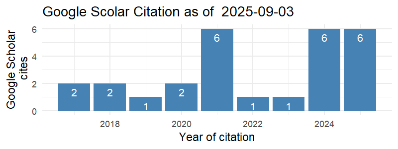

<link rel="stylesheet" href="styles.css" type="text/css">

<body style="background-color:white;">

<!-- <br></br> <br></br> -->

<!-- ## BIODATA PENSYARAH -->

<!-- <br></br> <br></br> -->

```{r include=FALSE}
library(scholar)

profile <- get_profile('qVPi6kYAAAAJ')
total_cites <- profile$total_cites
h_index <- profile$h_index
i10_index <- profile$i10_index
```

::: {style="display: flex;"}
::: {.column width="35%"}
<center>

{width="250"}

</center>
:::

::: {.column width="10%"}
  <!-- an empty Div (with a whitespace), serving as
a column separator -->
:::

::: {.column width="55%"}
**\<NAME\>**\
*Universiti Teknologi MARA\
Kedah Branch Campus*

\<Name\>, is a senior lecturer at the Faculty of Computer Science and Mathematics, Universiti Teknologi MARA (UiTM), Kedah Branch Campus, Malaysia.

**Total Cites:** `r total_cites` , **h Index:** `r h_index` , **i10 Index:** `r i10_index`

<center>

[{width="350"}](https://scholar.google.com/citations?hl=en&user=qVPi6kYAAAAJ)

</center>
:::
:::

### A. Profil Pensyarah

1.  Nama:

2.  No. Pekerja:

3.  Bidang Penghususan: **MATEMATIK**

4.  Fakulti/Pusat/Kampus: **FSKM, UITM KEDAH**

5.  Jawatan: **PENSYARAH KANAN**

6.  Gred Jawatan/Pangkat: **DM52**

7.  Status Pekerjaan: **TETAP / BERPENCEN**

8.  Warganegara: **MALAYSIA**

### B. Kelayakan Akademik

| Kelulusan (Bidang) | Nama IPT dan Negara | Tarikh Dianugerahkan |
|:------------------:|:-------------------:|:--------------------:|
|                    |                     |                      |
|                    |                     |                      |

### C. Kursus Pengajaran

#### Kursus yang Diajar

| Kod Kursus | Nama Kursus | Program |
|:----------:|:-----------:|:-------:|
|            |             |         |
|            |             |         |
|            |             |         |

#### Kursus yang boleh diajar

| Kod Kursus | Nama Kursus | Program |
|:----------:|:-----------:|:-------:|
|            |             |         |

### D. Pengalaman Kerja

| Jawatan | Nama dan Alamat Majikan | Tarikh Mula & Tamat |
|:-------:|:-----------------------:|:-------------------:|
|         |                         |                     |
|         |                         |                     |

### E. Aktiviti Penyelidikan / Penulisan / Pengkaryaan / Pembentangan Kertas Kerja

#### 1. Pembentangan Kertas Kerja

1.  

#### 2. Penyelidikan

| Tajuk | Amount Grant Diterima | Penaja | Tarikh Mula & Tamat |
|:-----:|:---------------------:|:------:|:-------------------:|
|       |                       |        |                     |

#### 3. Penerbitan

##### i. Buku / Bab

| Judul Buku/Bab | Peranan | Penerbit | Negara/Negeri Penerbit | Tarikh Diterbit |
|----------------|:-------:|:--------:|:----------------------:|:---------------:|
|                |         |          |                        |                 |

##### ii. Artikel/Rencana

| Tajuk Artikel/Rencana | Nama Jurnal/Majalah | Jid/Bil | Penerbit | Tarikh Diterbit |
|-----------------------|---------------------|:-------:|:--------:|:---------------:|
|                       |                     |         |          |                 |
|                       |                     |         |          |                 |
|                       |                     |         |          |                 |
|                       |                     |         |          |                 |
|                       |                     |         |          |                 |
|                       |                     |         |          |                 |
|                       |                     |         |          |                 |

##### iii. Pembentangan Kertas Kerja

| Tajuk Kertas Kerja | Nama Konferensi | Tempat/Negara | Tarikh Diterbit |
|--------------------|:---------------:|:-------------:|:---------------:|
|                    |                 |               |                 |

### F. Aktiviti Pentadbiran (dalam tempoh 3 tahun terakhir)

#### 1. Jawatan Pentadbiran / Akademik

| Nama Jawatan | Tarikh Dari | Tarikh Hingga |
|--------------|-------------|---------------|
|              |             |               |

#### 2. Jawatankuasa Di Dalam/Di Luar UiTM

| Nama Jawatankuasa | Jawatan | Tarikh Dari | Tarikh Hingga |
|:-----------------:|:-------:|:-----------:|:-------------:|
|                   |         |             |               |
|                   |         |             |               |
|                   |         |             |               |
|                   |         |             |               |
|                   |         |             |               |
|                   |         |             |               |

#### 3. Sumbangan Profesional/Masyarakat

| Nama Badan Profesional/Kebajikan | Jawatan | Tarikh Dari | Tarikh Hingga |
|:--------------------------------:|:-------:|:-----------:|:-------------:|
|                                  |         |             |               |

#### 4. Keahlian Dalam Badan Profesional

| Nama Badan Profesional/Kebajikan | No. Ahli | Jenis Keahlian | Peranan | Tarikh Dari | Tarikh Hingga |
|:--------------------------------:|:--------:|:--------------:|:-------:|:-----------:|:-------------:|
|                                  |          |                |         |             |               |

```{r include=FALSE}
library(scholar)
library(ggplot2)

cit <- get_citation_history('qVPi6kYAAAAJ')
png('scholar_citations_qVPi6kYAAAAJ.png', width=800, height=300, res=150)
ggplot(cit,aes(x=year,y=cites)) + geom_bar(stat='identity', fill="steelblue") + 
  theme_minimal() + 
  xlab('Year of citation') + 
  ylab('Google Scholar\n cites') + 
  geom_text(aes(label=cites), vjust=1.6, color="white", size=3.5) +
  ggtitle(paste('Google Scolar Citation as of ', Sys.Date(), sep = " ")) 
#  annotate('text',label=format(Sys.time(), "%Y-%m-%d %H:%M:%S %Z"), 
#           x=-Inf, y=Inf, vjust=1.5, hjust=-0.05, size=3, colour='blue')
dev.off()
```
