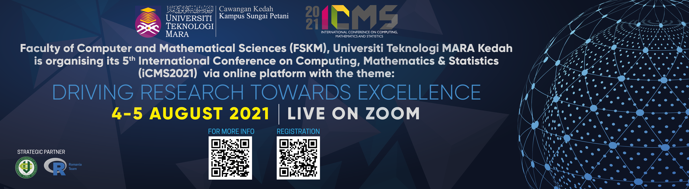

```{r setup, include=FALSE}
knitr::opts_chunk$set(echo = FALSE)

# Learn more about creating websites with Distill at:
# https://rstudio.github.io/distill/website.html
```

### Virtual Conference

### The 5^th^ International Conference on Computing, Mathematics and Statistics 2021 (iCMS2021)

### Date: 4 - 5 August 2021



## ABOUT

The International Conference on Computing, Statistics and Mathematics (iCMS) is a biennial conference commencing since 2013. The conference is hosted by the Faculty of Computer and Mathematical Sciences, Universiti Teknologi MARA (UiTM) Kedah, Malaysia. The focus of iCMS is on computing, mathematics and statistics discipline and the application centering on these fields of study.

Over the years, iCMS international conference has attracted many high quality papers from local as well as global contributors in various subjects pertaining to the three areas. Not to mention, our biggest success in terms of publication where all papers in iCMS2017 are published in indexed journals and proceeding. In the previous conference iCMS2019, more than 100 papers have been accepted. To date, nearly half of the papers presented at the conference have been published in selected Scopus indexed journals while the remaining papers are in final steps to be published in other various suitable indexed journals.

The organising committee had also successfully hosted pre-conference workshop namely, "Visualization of Tidy Data" that was conducted by international reputable expert, Dr. Matthias Templ from Statistics Austria and Vienna University of technology and received positive feedback from the participants.

iCMS2021 will be our fifth international conference. The theme of this coming conference is "Driving Research Toward Excellence". Given the rapidity with which computing, mathematics, and statistics are advancing in all areas of life, we strongly believed that this upcoming conference is the best platform available for researchers to come together presenting their practical solutions for a better tomorrow as well as become a catalyst for stimulating ideas to further enhance future research and innovations.

For more details please visit the [iCMS2021 Official Websites](https://uitmicms.wixsite.com/icms2021)  

[iCMS 2021 Onine Abstract Book](https://icms2021-program-book.netlify.app/)  


